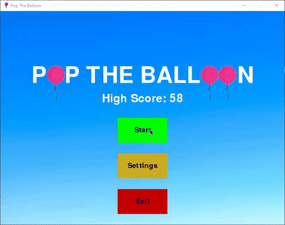

# Pop The Balloon

This is a game where you pop as many balloon as possible in 30 seconds.



## Installation

Use the package manager [pip](https://pip.pypa.io/en/stable/) to install pygame if you haven't already.

```bash
pip install pygame
```

Then, run the game like other python files.

```bash
python main.py
```

## Controls

Left-Click = Shoot  
P = pause/unpause
